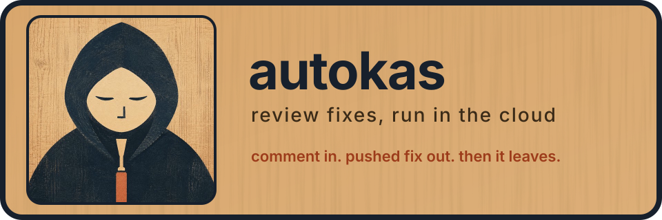

<p align="center">
  
</p>

<p align="center">
  <a href="runner.py">runner</a> ·
  <a href="config.example.json">config</a> ·
  <a href="consult.py">advisor</a> ·
  <a href="deploy.py">deploy</a> ·
  <a href="docs/operations.md">operations</a> ·
  <a href="kas-voice-profile.md">voice profile</a> ·
  <a href="skills">skills</a>
</p>

autokas fixes CodeRabbit, Cursor Bugbot and Cursor Security Reviewer findings without anyone sitting at a keyboard. a signed GitHub webhook lands on Modal, a configured omp agent checks out the pull request in a disposable container, runs the repo's checks, commits, pushes to the PR branch and exits.

the runner dispatches the job, not the agent's working process. omp owns investigation, edits, checks and publication. there is no controller, scheduler, database or recovery loop. the one review autokas writes itself comes from PR-Agent, described below.

## how a job runs

1. GitHub sends `issue_comment`, `pull_request_review_comment` or `pull_request_review` to the Modal webhook. unsigned requests get `401`.
2. the receiver accepts only completed CodeRabbit reviews or comments that carry the fenced agent prompt, and `cursor[bot]` inline comments that carry a Bugbot marked finding or a Security Reviewer finding, on a PR whose head belongs to the approved base repository. each bot is matched by its configured login and id from `config.example.json`, and a bot's comments are only parsed with that bot's own format.
3. a Modal Dict claims the review and finding fingerprints, so duplicate deliveries don't start a second job.
4. one `PRWorker` per repo and PR clones the repo, checks out the PR head, verifies its SHA and starts omp with the job's model profile.
5. omp fixes what's still valid, commits as `autokas[bot]` in Conventional Commits form, pushes, updates its queued status comments and posts one outcome comment.
6. the container exits.

Cursor's Bugbot and Security Reviewer both post as `cursor[bot]`, so its inline comments are read in either format. a Security Reviewer finding has a `CURSOR_AUTOMATION_ID` marker and an "Agentic Security Review" heading, and its prompt keeps only the severity and description. review summaries and issue comments from either don't start finding jobs, even when they contain marked finding text. a Cursor review batch uses only its collected inline findings as the agent prompt. CodeRabbit keeps its review-prompt-first behavior, falling back to joined inline prompts when the review has none.

### PR-Agent reviews

autokas posts one PR-Agent `/review` comment as `autokas[bot]` on a same-repo PR when it's opened as ready, or when it moves from draft to ready. later pushes don't trigger another review. drafts, closed PRs, fork heads, generated docs PRs and PRs marked `autokas:ignore` are skipped. setting `pr_review.enabled` to `false` turns off both the automatic reviews and `@autokas review`.

the review runs in its own small Modal function with the pinned `pr_review.pr_agent_version`, not in the omp coding container. autokas checks out the exact queued head and hands PR-Agent only the diff from the merge base, with that checkout for file context, so PR-Agent never gets a GitHub token. it calls `pr_review.model` through the same CLIProxyAPI service with no fallback model. autokas posts the result as one comment, and only if the PR is still on the reviewed head. a push during the review means nothing is posted. it never pushes, commits, labels or resolves threads. PR-Agent doesn't see the PR title, description or commit messages, and repository `.pr_agent.toml` files are ignored.

each finding in a review is tagged `[P0]` to `[P3]`: P0 is a security hole, data loss or an outage, P1 a bug in normal use, P2 a bug under specific inputs or conditions, and P3 maintainability, style or a speculative concern. an untagged finding counts as P2. when a review has findings at or above `pr_review.fix_severity` (default `P2`), autokas queues one fix job for them through the same path as CodeRabbit and Bugbot findings, with a queued status linking the review. if that fix pushes a commit, autokas reviews the new head, and the next round's findings get the next fix. a review with nothing at or above the threshold, a fix that pushes nothing, a push from someone else during a round, or reaching `pr_review.max_fix_rounds` (default 3 fix runs) ends the loop. the last review is still posted. set `fix_severity` to `null` to keep reviews and turn off the fixes. PRs marked `autokas:ignore` and generated docs PRs get no automatic fixes, even when `@autokas review` reviewed them.

## @autokas commands

you don't have to wait for CodeRabbit. start a GitHub comment with `@autokas` and an instruction, and autokas runs it as its own job.

- **on a PR**, in the conversation or on a review thread, it works on that PR's head branch and pushes there.
- **on an issue**, it branches from the default branch as `autokas/issue-<number>`, does the work and opens one PR containing `Closes #<number>`.
- only users with `write` or `admin` access on the repo can trigger it. other people's comments are ignored.
- each comment runs once. editing a comment doesn't rerun it, so post a new comment for a follow-up.
- commands still run on PRs marked `autokas:ignore` and on generated docs PRs.
- a PR command that starts with the word `review` posts a fresh PR-Agent review of the current head instead of starting a coding job, and its findings start the fix loop above. anything after `review` goes to PR-Agent as extra instructions, so `@autokas review focus on the auth changes` steers it. it works on drafts too. on an issue, `review` is an ordinary command.

```text
@autokas the date filter drops the last day of the range, fix it and add a test
```

## advisors

a repo can be paired with an advisor: an external service omp consults before it changes core business rules or intended behavior. the advisor answers business-intent questions only. it isn't a technical, safety or security gatekeeper, and omp still judges those against the code.

`consult.py` is the client. it sends a bounded question, keeps the full answer in a private temp file for omp to read, and fails closed on any interrupted or empty response. an advisor's bearer and endpoint go only to jobs for repos it's paired with.

the advisor is paired to one repository owner through `jarvis_owner` in the config. other owners get technical fixes with no advisor, and business-logic changes there are reported instead of made. the full policy is in [docs/operations.md](docs/operations.md).

autokas also opens follow-up docs PRs after merges. docs jobs targeting the same repo/base branch wait in the existing Modal worker pool, while reviews keep per-PR concurrency. publication refreshes the base and reconciles stale docs and declared postprocess outputs before an exact-head merge. explicit write-authorized commands can still repair generated docs PRs. see [operations](docs/operations.md) for the bounded recovery and verification limits.

## where it runs

autokas is a GitHub App owned by `kastheco`. the repositories it's installed on are the only boundary, and the runner keeps no second allowlist. mint-per-repo installation tokens keep one owner's credentials away from another's.

the installed set is managed in the App's GitHub installation settings. events arrive through one App-level webhook pointed at the receiver and subscribed to `issue_comment`, `pull_request`, `pull_request_review` and `pull_request_review_comment`, so installing the App on a repo is all it takes to start delivery. no per-repo hooks are needed.

the Modal app is `omp-runner`. the repo was renamed to `autokas` on GitHub, but app, function and package names stay as they are so the App webhook and secrets keep working. models come from the Railway CLIProxyAPI service (its URL is `omp_models` in your config) through omp's native `models.yml`.

## set up

```sh
uv venv
uv pip install -r requirements.txt
source .venv/bin/activate
modal token new
modal profile list
modal environment list
```

do the Modal login and consent yourself. then copy the example config and edit it:

```sh
cp config.example.json config.json
```

`config.json` holds your webhook URL, provider URL and advisor pairing and stays untracked. then create two secrets in the approved environment, entering values through Modal's own form or SDK, never through arguments, chat or tracked files:

| secret | values | scope |
| -- | -- | -- |
| `omp-runner-webhook` | `GITHUB_WEBHOOK_SECRET` | receiver only |
| `omp-runner-worker` | `GITHUB_APP_ID`, `GITHUB_APP_PRIVATE_KEY`, `CLI_PROXY_API_KEY`, `JARVIS_RUNNER_TOKEN` | worker only |

`./setup_autokas.py` creates the GitHub App with its webhook inactive, finds its `kastheco` installation and can write the worker secret and deploy. it asks before each of those steps. set the App webhook secret to the value in `omp-runner-webhook`, then activate the webhook in the App settings.

model logins live in the Railway proxy volume, not Modal. export `RAILWAY_PROJECT_ID`, `RAILWAY_ENVIRONMENT_ID` and `RAILWAY_SERVICE_ID` first, the scripts refuse to run without them:

```sh
npm run login:codex
npm run login:claude
```

## deploy

pushes to `main` run `.github/workflows/deploy.yml`, which runs the tests against `config.example.json`, materializes your real config from the `AUTOKAS_CONFIG_JSON` Actions secret, and then runs `deploy.py`. its output is written to private runner files, so public logs show only exit statuses. it saves the reconcile window, drains running work, redeploys with `modal deploy --strategy recreate runner.py`, checks that an unsigned request returns `401` and that a redelivered App event returns `200` or `202` with the expected source revision, then replays anything missed on every installed repo. App webhooks can't be paused through the API, so deliveries that land during the cutover are recovered by that replay. rollback is a revert on `main`.

## test

```sh
python -m unittest discover -v
```

covers intake and identity boundaries, review state and prompt selection, installation token isolation, clean-review acknowledgments, deploy reconciliation and docs follow-up merge safety, all without external calls.

## stop it

add `autokas:ignore` or `@autokas ignore` anywhere in a PR body to skip automatic finding fixes, clean-review acknowledgments and docs-update jobs when it merges. markers are case-insensitive. [`@autokas` commands](#autokas-commands) from users with write access still run.

deactivate the App webhook to stop new intake everywhere and let running work finish, or uninstall the App from one repo to stop that repo's deliveries. neither cancels calls already queued. cancel an active job with Modal's native call cancellation, then reconcile the PR before doing anything else.

## repository map

```text
runner.py             webhook receiver, dispatcher, PR worker and docs worker
config.example.json   example models, tools, profiles, timeouts and git identity
consult.py            bounded client for advisor consultations
deploy.py             drain, deploy, verify and reconcile
setup_autokas.py      one-time GitHub App and Modal setup wizard
kas-voice-profile.md  voice rules appended to every job's system policy
skills/               bundled skills, with pinned sources and licenses
test_*.py             unit tests for intake, auth, dispatch, deploy and consult
docs/                 readme banner and long-form operations notes
```

for the advisor rules, provider accounts, live verification path and duplicate-claim limits, read [`docs/operations.md`](docs/operations.md).
